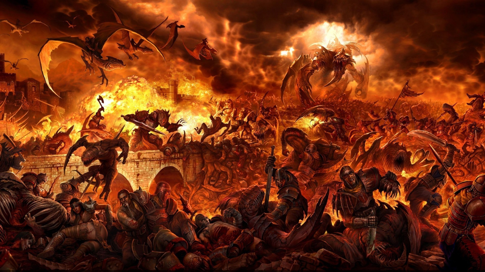

# War
You decide to wage war against the humans. With your command, your army is ready for war. You join them in the frontlines killing humans after humans. On the frontlines, you met the hero.

You battle with him commenced. You easily overpowered him.   
  
What is your next action?
---
[Kill](../ending/demon-win.md)

[Spare](death.md)